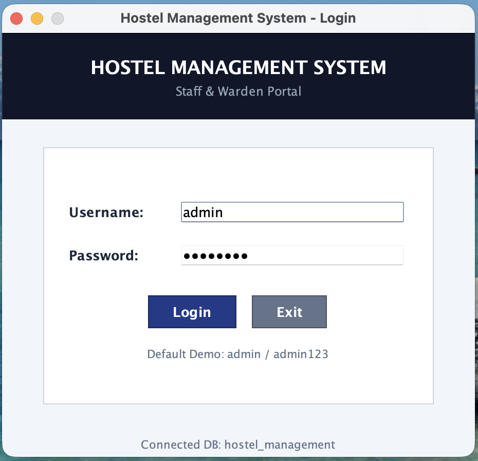
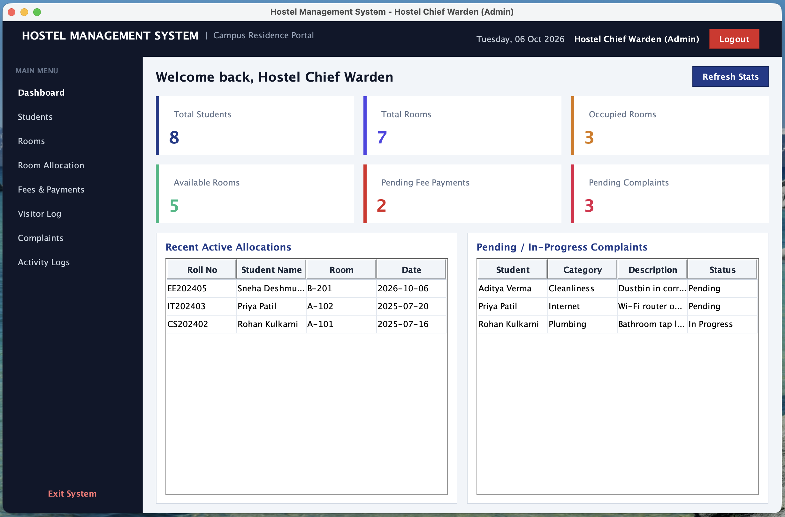
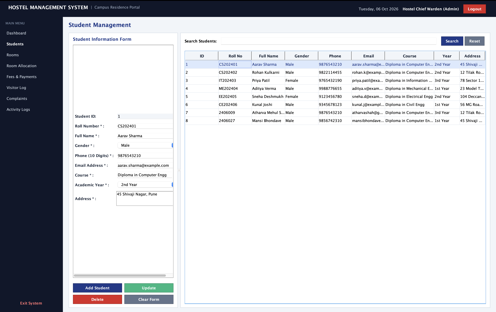
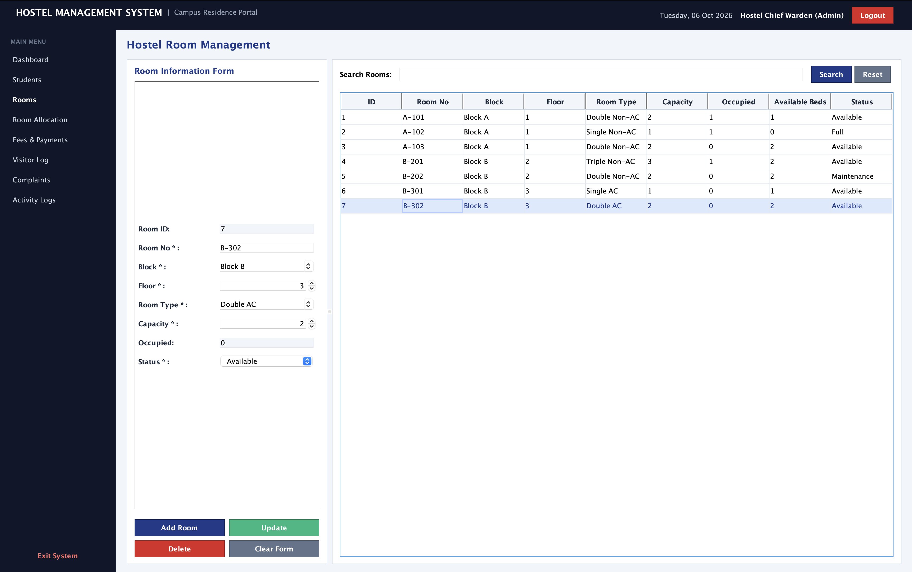
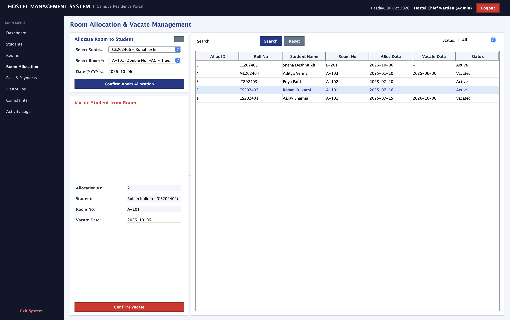
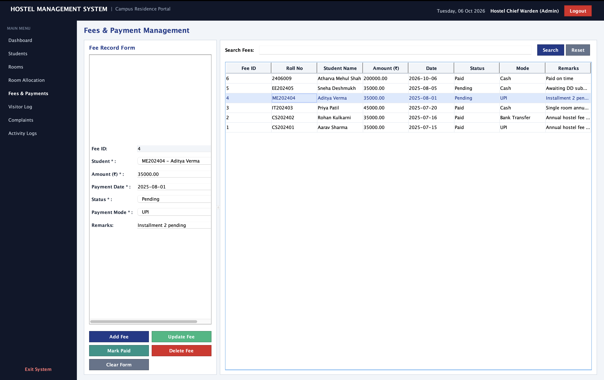
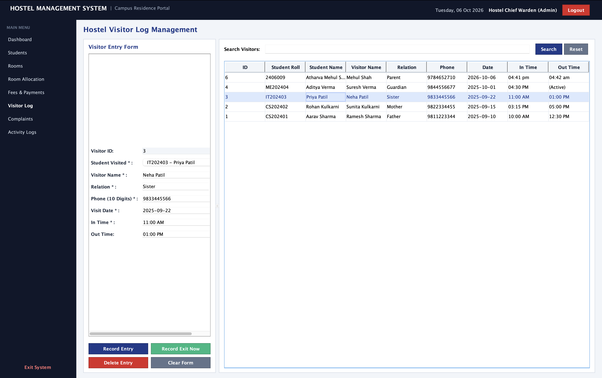
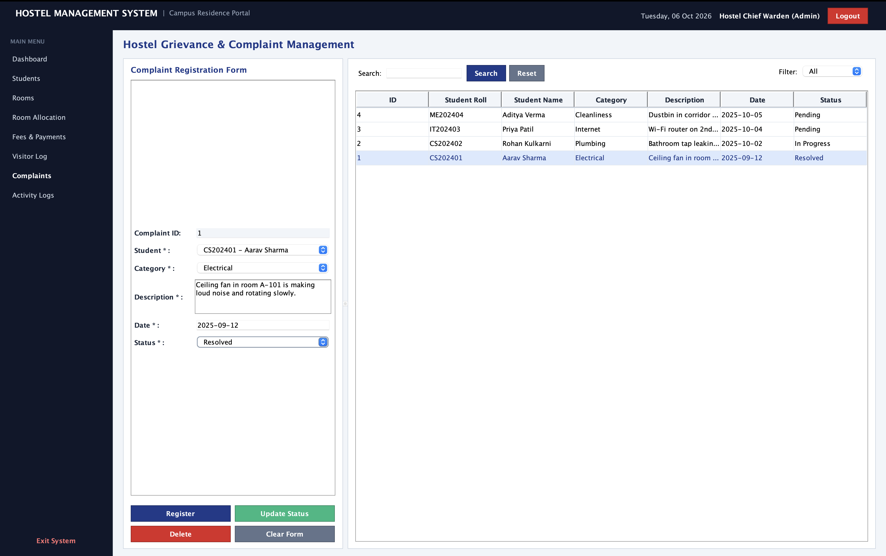
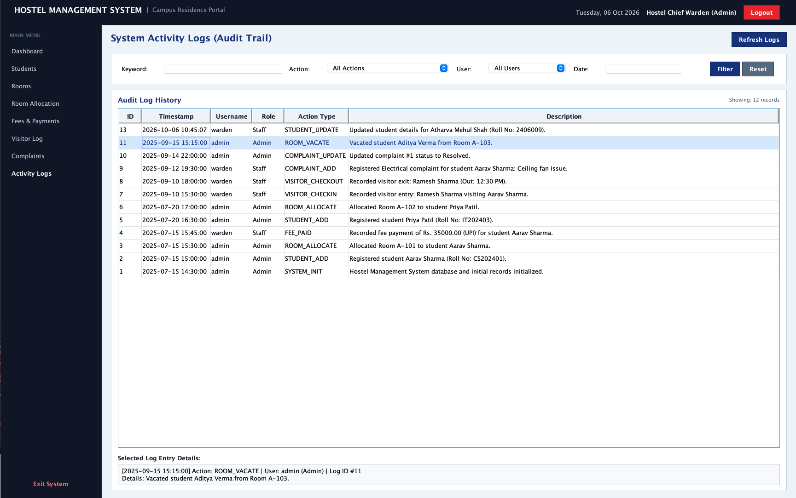
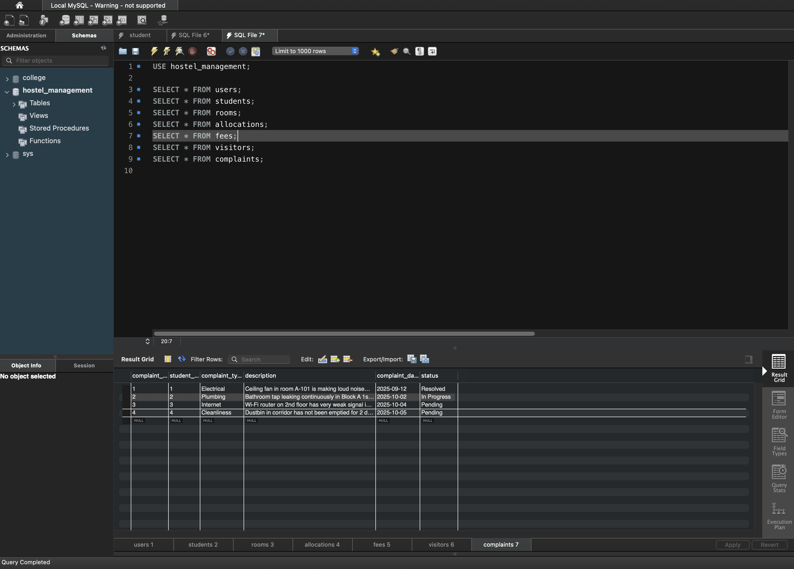

# Java Hostel Management System

A desktop-based Hostel Management System developed using **Java Swing/AWT, JDBC, and MySQL**.

The application provides a centralized system for managing hostel students, rooms, room allocations, fees, visitors, complaints, and administrative activity logs. It uses a layered structure with separate **UI, DAO, model, and database** components.

## Features

* Admin and warden authentication
* Dashboard with hostel statistics
* Student management
* Room management
* Room allocation and vacating
* Automatic room occupancy tracking
* Hostel fee management
* Visitor entry and exit management
* Student complaint management
* Administrative activity logs
* Student and room search
* Form validation
* MySQL database persistence
* JDBC-based database connectivity
* Sample database records for demonstration
* Self-test utility for basic system verification

## Technology Stack

| Technology      | Purpose                          |
| --------------- | -------------------------------- |
| Java            | Core application development     |
| Swing           | Desktop graphical user interface |
| AWT             | UI components and layouts        |
| JDBC            | Java–MySQL connectivity          |
| MySQL           | Relational database              |
| MySQL Workbench | Database creation and management |

## Application Architecture

The application follows a simple layered architecture:

```text
┌──────────────────────────────────────┐
│          Java Swing / AWT UI         │
│                                      │
│ Login • Dashboard • Student • Room   │
│ Allocation • Fees • Visitors         │
│ Complaints • Activity Logs           │
└──────────────────┬───────────────────┘
                   │
                   ▼
┌──────────────────────────────────────┐
│               DAO Layer              │
│                                      │
│ StudentDAO • RoomDAO • FeeDAO        │
│ AllocationDAO • VisitorDAO           │
│ ComplaintDAO • UserDAO               │
│ ActivityLogDAO • DashboardDAO        │
└──────────────────┬───────────────────┘
                   │
                   │ JDBC
                   ▼
┌──────────────────────────────────────┐
│          MySQL Database              │
│         hostel_management            │
└──────────────────────────────────────┘
```

## Application Modules

### 1. Authentication

The application starts with a login screen.

Users are authenticated against the MySQL `users` table before accessing the management dashboard.

Supported roles include:

* Administrator
* Warden

### 2. Dashboard

The dashboard provides an overview of the hostel, including statistics such as:

* Total students
* Total rooms
* Occupied rooms
* Available rooms
* Pending fees
* Pending complaints

The statistics are retrieved from the database rather than being hardcoded.

### 3. Student Management

The Student Management module provides CRUD operations for student records.

Available operations:

* Add student
* Update student
* Delete student
* Search students
* View all students
* Clear form

Student information includes:

* Roll number
* Name
* Gender
* Phone
* Email
* Course
* Year
* Address

### 4. Room Management

The Room Management module manages hostel room information.

Available operations:

* Add room
* Update room
* Delete room
* Search rooms
* View room records

Room information includes:

* Room number
* Block
* Floor
* Room type
* Capacity
* Occupancy
* Status

Room occupancy and availability are maintained as students are allocated or vacated.

### 5. Room Allocation

The Allocation module connects students with hostel rooms.

The system supports:

* Room allocation
* Viewing active allocations
* Vacating rooms
* Occupancy updates
* Room availability checks
* Prevention of duplicate active allocations

When a student is allocated or vacated, the corresponding room occupancy is updated in the database.

### 6. Fee Management

The Fee Management module maintains hostel payment records.

Information includes:

* Student
* Amount
* Payment date
* Payment status
* Payment mode
* Remarks

Supported payment modes include:

* Cash
* UPI
* Card
* Bank Transfer

### 7. Visitor Management

The Visitor Management module records visitors entering the hostel.

Information includes:

* Student
* Visitor name
* Relation
* Phone
* Visit date
* In time
* Out time

The module also supports recording the visitor's exit time.

### 8. Complaint Management

Students' hostel-related complaints can be recorded and tracked.

Complaint information includes:

* Student
* Complaint type
* Description
* Complaint date
* Status

Complaint statuses include:

* Pending
* In Progress
* Resolved

### 9. Activity Logs

Administrative actions are recorded in the `activity_logs` table.

This provides a basic audit trail of important activities performed within the application.

## Database

The application uses a MySQL database named:

```text
hostel_management
```

The database contains the following tables:

| Table           | Purpose                         |
| --------------- | ------------------------------- |
| `users`         | Authentication and user roles   |
| `students`      | Student records                 |
| `rooms`         | Hostel room records             |
| `allocations`   | Student-room allocations        |
| `fees`          | Hostel fee/payment records      |
| `visitors`      | Visitor records                 |
| `complaints`    | Student complaints              |
| `activity_logs` | Administrative activity history |

The complete database structure and demonstration data are provided in:

```text
database.sql
```

## Requirements

Before running the application, install:

* Java JDK 8 or later
* MySQL Server
* MySQL Workbench
* Git

The project includes MySQL Connector/J:

```text
lib/mysql-connector-j-8.3.0.jar
```

## Database Setup

### 1. Start MySQL

Make sure your MySQL server is running.

### 2. Open MySQL Workbench

Open:

```text
database.sql
```

### 3. Execute the script

The script creates:

```text
hostel_management
```

and all required tables and demonstration records.

### 4. Verify the database

In MySQL Workbench:

```sql
USE hostel_management;
SHOW TABLES;
```

You should see:

```text
users
students
rooms
allocations
fees
visitors
complaints
activity_logs
```

## Configuration

The project does not store database credentials in the repository.

Copy:

```text
db.properties.example
```

to:

```text
db.properties
```

Then edit the local file:

```properties
db.url=jdbc:mysql://localhost:3306/hostel_management?useSSL=false&allowPublicKeyRetrieval=true&serverTimezone=UTC
db.user=root
db.password=YOUR_MYSQL_PASSWORD
```

Replace:

```text
YOUR_MYSQL_PASSWORD
```

Also replace DbConnection.java code with your local MySQL password:
```text
private static String password = "[PASSWORD]";// replace with your password
```


### Important

`db.properties` is intentionally excluded from Git using `.gitignore`.

Never commit real database passwords, API keys, tokens, or other credentials to a public repository.

## Running the Application

### Option 1 — Using the helper script

On macOS/Linux:

```bash
chmod +x run.sh
./run.sh
```

On Windows:

```bat
run.bat
```

### Option 2 — Using an IDE

Import/open the project in a Java IDE such as Eclipse.

Make sure:

1. The JDK is configured.
2. The MySQL Connector/J JAR is added to the project classpath.
3. MySQL Server is running.
4. The `hostel_management` database has been created.
5. `db.properties` contains the correct local credentials.

Run:

```text
src/Main.java
```

### Option 3 — Command Line

Compile the source files with the MySQL Connector/J JAR on the classpath.

Example on macOS/Linux:

```bash
javac -cp "lib/mysql-connector-j-8.3.0.jar" -d bin $(find src -name "*.java")
```

Run:

```bash
java -cp "bin:lib/mysql-connector-j-8.3.0.jar" Main
```

On Windows, use `;` instead of `:` in the classpath.

## Default Login Credentials

The database script contains demonstration accounts.

### Administrator

```text
Username: admin
Password: admin123
```

### Warden

```text
Username: warden
Password: warden123
```

These credentials are intended for local demonstration purposes.

For production use, passwords should be securely hashed and managed using a stronger authentication system.

## Project Structure

```text
Java-Hostel-Management-System/
│
├── src/
│   ├── database/
│   │   └── DBConnection.java
│   │
│   ├── model/
│   │   ├── User.java
│   │   ├── Student.java
│   │   ├── Room.java
│   │   ├── Allocation.java
│   │   ├── Fee.java
│   │   ├── Visitor.java
│   │   ├── Complaint.java
│   │   └── ActivityLog.java
│   │
│   ├── dao/
│   │   ├── UserDAO.java
│   │   ├── StudentDAO.java
│   │   ├── RoomDAO.java
│   │   ├── AllocationDAO.java
│   │   ├── FeeDAO.java
│   │   ├── VisitorDAO.java
│   │   ├── ComplaintDAO.java
│   │   ├── ActivityLogDAO.java
│   │   └── DashboardDAO.java
│   │
│   ├── ui/
│   │   ├── LoginFrame.java
│   │   ├── DashboardFrame.java
│   │   ├── DashboardPanel.java
│   │   ├── StudentPanel.java
│   │   ├── RoomPanel.java
│   │   ├── AllocationPanel.java
│   │   ├── FeePanel.java
│   │   ├── VisitorPanel.java
│   │   ├── ComplaintPanel.java
│   │   ├── ActivityLogPanel.java
│   │   └── UIUtils.java
│   │
│   ├── test/
│   │   └── SystemSelfTest.java
│   │
│   └── Main.java
│
├── lib/
│   └── mysql-connector-j-8.3.0.jar
│
├── database.sql
├── adminLogs.sql
├── db.properties.example
├── .gitignore
├── run.sh
├── run.bat
├── LICENSE
└── README.md
```

## Testing

The project includes a basic system self-test:

```text
src/test/SystemSelfTest.java
```

The application was designed to verify important operations such as:

* Database connectivity
* Authentication
* Student operations
* Room operations
* Allocation operations
* Fee operations
* Visitor operations
* Complaint operations
* Activity logging

## Screenshots

### Login


### Dashboard


### Student Management


### Room Management


### Room Allocation


### Fee Management


### Visitor Management


### Complaint Management


### Activity Logs


### MySQL Database


## Project Goals

This project was developed to demonstrate practical implementation of:

* Java programming
* Object-oriented programming
* AWT and Swing
* Event handling
* JDBC
* MySQL
* SQL queries
* CRUD operations
* Exception handling
* Database relationships
* Layered application design

## Future Scope

Possible improvements include:

* Secure password hashing
* More granular role-based permissions
* Online fee payment
* Email/SMS notifications
* Student self-service portal
* QR-based visitor management
* Automated report generation
* Database backup and restore
* Cloud-hosted database
* Web and mobile versions
* Advanced analytics and reporting

## Version

Current release:

**v1.0.0**

This is the first stable release of the Hostel Management System.

## License

This project is licensed under the **MIT License**.

See the [`LICENSE`](LICENSE) file for details.

## Author

**Atharva Shah**

Computer Engineering Student

GitHub: [@AtharvaShah-Git](https://github.com/AtharvaShah-Git)

---

If you find this project useful for learning Java, Swing, JDBC, or MySQL, feel free to explore the source code and adapt it for educational purposes.
